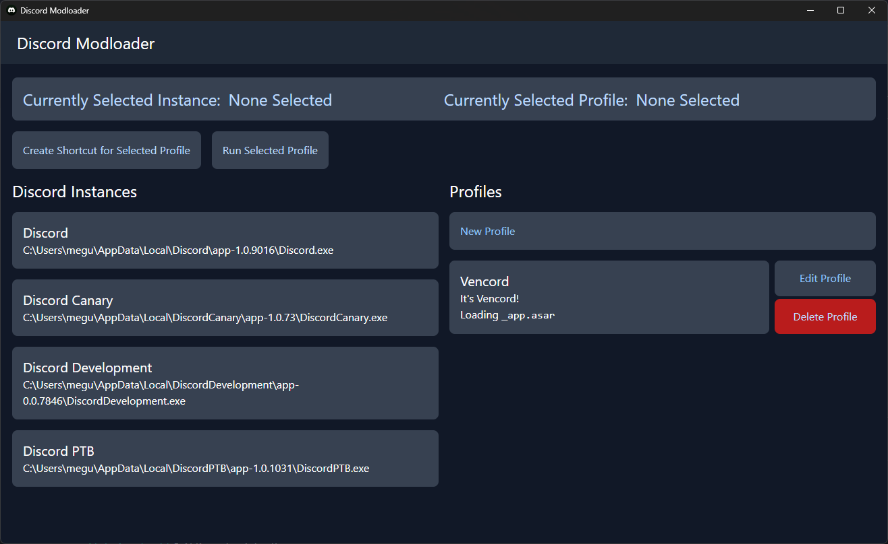

# Discord ModLoader

An in-memory mod loader for discord that works without modifying Discord's files.

You can create a profile for each mod you use, and create desktop shortcuts for easy access.

You can customise the user data directory for each profile, isolating each instance completely.

# How to

When creating a new profile, you're presented with a few options. Make sure to read all the documentation below if you get lost. It seems complicated at first, but it's all fairly easy to configure.

## Name

The name of your profile - this is unimportant and can be whatever you want.

## Description

The description of your profile - this is also unimportant.

## Original ASAR Name

When you normally install a Discord mod, it renamed `app.asar` to something else so that it can make it's own fake `app.asar`. This should be the new name of the `app.asar`. For example, with Vencord, this value should be `_app.asar`. With Replugged, this should be `app.orig.asar`, etc.

# Mod Entrypoint

This is the first JS file of the mod that gets run. If you aren't sure what this value should be, see what your mod's `app.asar/index.js` normally requires. With vencord, this should point to your `dist\patcher.js` file.

# Custom User Directory Name

Use this option if you want to isolate your profile data. This is the "user data" folder for your profile. If you leave it blank, it will use your discord instance's default directory. If you put something in here, e.g. `Testing01`, it will go to `%AppData%\DiscordModHook\AppData\Testing01`.

# ASAR Hook Toggle Query

Terribly named, CaSe sensitive, and usually not necessary, this is the string that gets checked when the injector needs to unhook the app.asar proxy. This needs to match the **end** of the path being loaded. By default, this string will just be the same as your mod entrypoint. It's very unlikely that you will need to change this.

As an example, if your mod entrypoint is `C:\Users\megu\Vencord\dist\patcher.js`, you would probably want this value to be at minimum, `Vencord\dist\patcher.js`.

# To Do

- [ ] Automatic mod downloading (this is already supported in libmodhook, just needs adding to the GUI)
- [ ] Make an installer for Discord ModLoader
- [ ] Linux Support (looking for sponsor)
- [ ] MacOS Support (looking for sponsor)
- [ ] Perhaps register a URI scheme to load profiles instead of pointing directly to the EXE. This would pair well with an installer.

# Questions?

Open a GitHub issue

# Where do the `.dll` files come from?

https://github.com/meguminsama/discord-modhook
